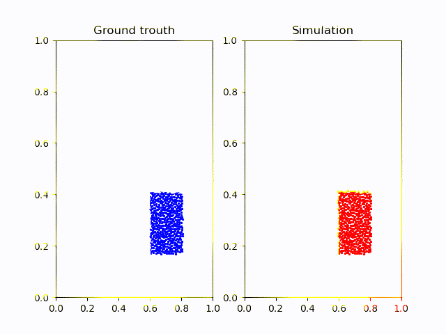

**Github**: [github.com/itsadeepizza/GNN/tree/main/physics_simulation](https://github.com/itsadeepizza/GNN/tree/main/physics_simulation)

[//]: # (Add a gif of the simulation below)

A [2020 paper](https://www.deepmind.com/publications/learning-to-simulate-complex-physics-with-graph-networks)
from deepmind showed how to simulate complex interaction between physical
particles using Graph Neural Network.

We have decided to try to recreate the model used for this task "from scratch", based solely on the paper, and 
occasionally using an [unofficial pytorch implementation](https://github.com/wu375/simple-physics-simulator-pytorch-geometry) 
to help us.

As we are limited in hardware (4GB Quadro GPU on a laptop) and our aim was not to produce a model
so accurate as the one of Deepmind, we trained only on a small portion of dataset, the "Water Drop".

While the simulation is far from perfect, it still showcases the effectiveness of the model. 
It's worth noting that the model calculates 200 frames starting only from the initial positions, which can result in a significant accumulation of errors over time.

