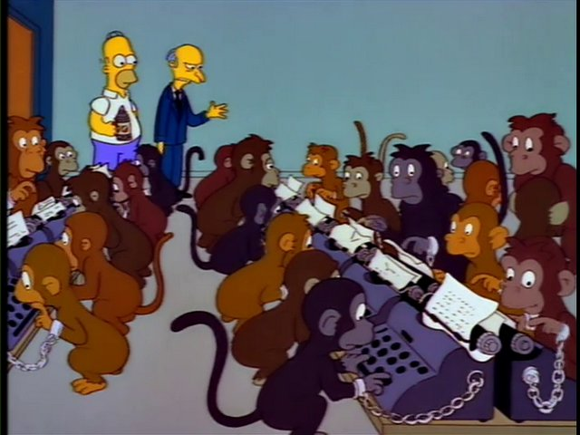

**🐱  Github**: [github.com/itsadeepizza/nlp](https://github.com/itsadeepizza/nlp)

Language is probably one of the finest and most impressive inventions. 

Not only does it serve as the primary means of conveying knowledge to others, but it also plays a crucial role in shaping our thoughts and understanding of the world around us. 

The close relationship between language and thought is likely the reason why **natural language processing (NLP)** has been a driving force in the advancement of many techniques used in other areas of deep learning, such as [CNNs](https://en.wikipedia.org/wiki/Convolutional_neural_network#Time_delay_neural_networks), [recurrent networks](https://developer.nvidia.com/discover/recurrent-neural-network), and [transfomers](https://arxiv.org/abs/1706.03762).

We worked on three different NLP projects:
* The creation of a dataset sourced from the Italian version of Wikipedia, which was used to train a **word2vec model for word embedding**.

    🐱 [Link github](https://github.com/itsadeepizza/nlp/tree/master/sentences_dataloader)

* The development of a custom transformer encoder from scratch, which was used to perform **sentiment analysis on Italian tweets**. Performance has been compared with a random forest classifier.

    🐱 [Link github](https://github.com/itsadeepizza/nlp/tree/master/sentiment_analysis)

* The construction of a **transformer decoder-only for text generation**, which was trained using the Wikipedia dataset from our previous project.

    🐱 [Link github](https://github.com/itsadeepizza/nlp/tree/master/babyGPT)

