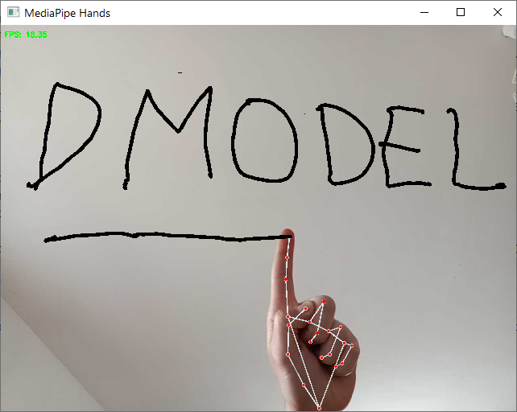
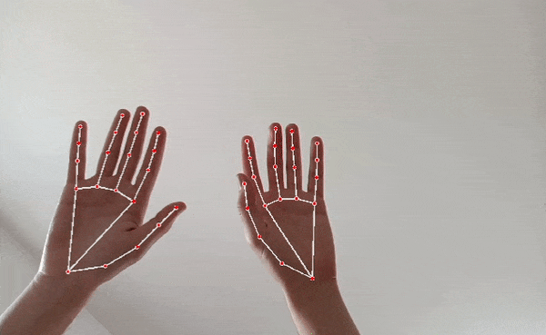
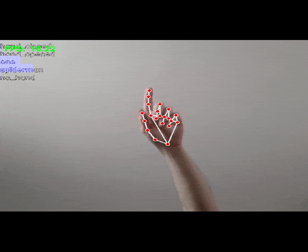
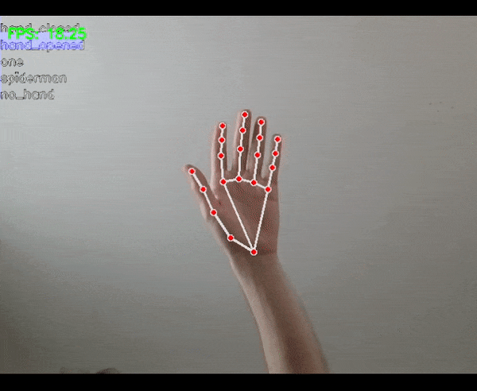

**Github**: [github.com/itsadeepizza/pose_estimation](https://github.com/itsadeepizza/pose_estimation)

This project is an implementation of a virtual whiteboard using hand gestures recognition. The project is based on the MediaPipe library and is entirely written in Python.
You write with the right hand, using the "one" gesture, and you can erase with the left hand, using an open hand.

## Gesture recognition

The MediaPipe library allows for hand detection and tracking, but not for gesture recognition. Therefore, we decided to create our own gesture recognition model, which is essential if we want to associate specific instructions with different gestures.

Initially, we only used the ratio between variance of finger tip and base positions to distinguish between an open and closed hand, but eventually we decided to implement a proper gesture recognition system.

We opted for a fairly simple approach that turned out to be quite effective: we implemented a script (make_dataset.py) to generate landmark datasets by simply recording the output of MediaPipe while we performed a gesture in front of the camera for a couple of minutes, moving our hand to change its position and orientation. In total, four gestures were performed: open hand, closed hand, one, and "Spiderman" (index and pinky fingers extended, middle and ring fingers folded, thumb tucked in).

Two training and testing datasets (included in the repository) were recorded in two separate sessions using different cameras. Unfortunately, all of the gestures in the dataset were performed by the same subject.

The landmarks were then preprocessed to normalize them in terms of position, size, and angle, before testing various ML algorithms to find an effective and fast enough model that would not affect the framerate. The SVM proved to be an optimal choice for the task.

## Bayesian Filtering (HMM and Kalman)

The result was a virtual whiteboard that worked quite well, but occasionally had some stuttering due to small errors in landmark or gesture recognition.

To make the result smoother (but mostly because we were curious to test this approach), we implemented two Bayesian filters:

- An HMM filtering ([here](https://itsadeepizza.github.io/2023-03-12-hmm_filtering/) is the post we wrote on the topic) for gesture recognition;
- A Kalman filter for the position of the index finger (which represents the tip of our virtual pen).

**Plain model**:

**With HMM Filtering**:

